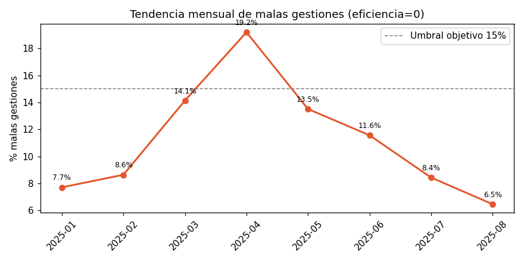
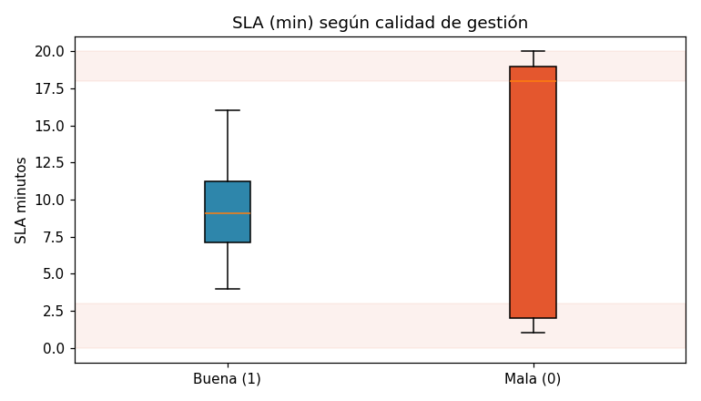
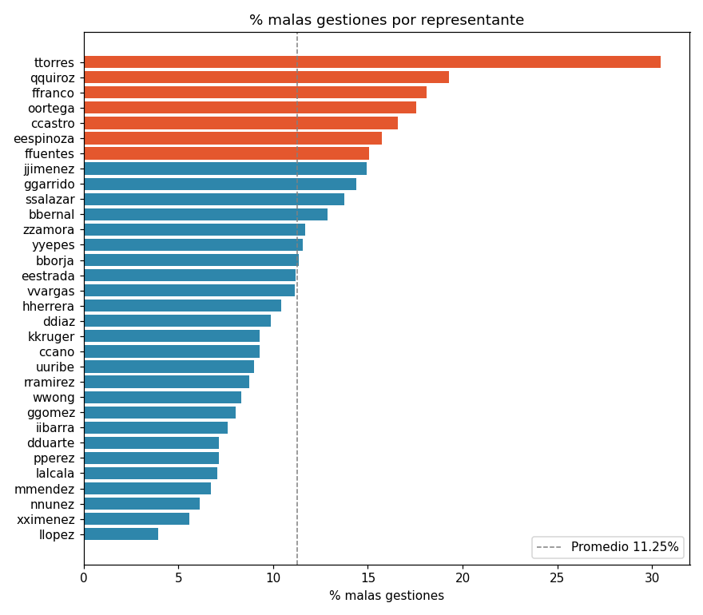
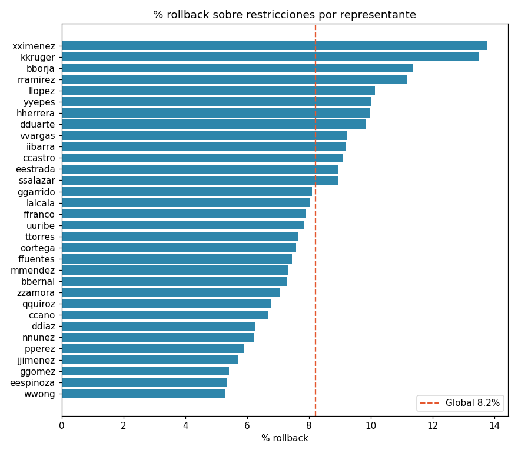

# Revisión de reclamos de un marketplace — Análisis de operación de soporte (datos sintéticos)

Proyecto de portafolio de **análisis de datos**: generación de datos sintéticos realistas, modelado dimensional (esquema estrella), tablero en Power BI y un EDA reproducible en Python con narrativa de hallazgos.

> ⚠️ **Datos 100% sintéticos.** La base fue generada con Python/pandas/numpy. No contiene información real de ninguna empresa ni persona. Está diseñada para parecer realista y permitir storytelling analítico sin exponer datos sensibles. **No usar para conclusiones del mundo real.**

📊 **También en Kaggle:** [Dataset](https://www.kaggle.com/datasets/luisalcal/marketplace-claims-review-synthetic-latam) · [Notebook de EDA](https://www.kaggle.com/code/luisalcal/01-eda-reclamos-kaggle)

---

## 🎯 El problema simulado

Se modela la **operación de revisión de reclamos** de un marketplace / e-commerce en Latinoamérica. Cada fila es **un caso de reclamo** gestionado por un representante de soporte: cuándo se creó, quién lo atendió, qué tan rápido lo resolvió (SLA), si se consideró de alto riesgo, si se aplicó una restricción a la cuenta, si esa restricción se revirtió (rollback), el producto reclamado, el país, el canal de contacto y una **bandera de calidad (`eficiencia`)** que simula el resultado de una revisión automatizada sobre la gestión.

El objetivo analítico es responder:

- ¿Cómo se distribuyen los casos de **alto riesgo (HIGH)** y cómo evolucionan mes a mes?
- ¿Qué tan bien **gestionan los representantes** y cómo varían entre sí?
- ¿Se **cumple el SLA** y cómo se relaciona con la calidad de la gestión?
- ¿Con qué frecuencia se **aplican restricciones** y qué proporción se **revierte (rollback)**?
- ¿Hay **patrones por país, producto, canal y estacionalidad**?

---

## 📊 La base de un vistazo

| | |
|---|---|
| Registros | **204.656 casos** |
| Representantes | **32** |
| Periodo | **enero–agosto 2025** |
| Países (LATAM) | **9** |
| Productos | **26** |
| Canales | **5** |
| Valor reclamado total | **~117,2 M USD** |
| Nulos / duplicados | **0 / 0** |

---

## 🔑 Hallazgos clave

- **Calidad (`eficiencia`): 88,7% de buena gestión**, por encima del objetivo del 85%.
- **Tendencia de errores:** suben hasta **abril (mes crítico, 19,2% de malas gestiones)** y bajan de forma sostenida hasta **agosto (6,5%)**.
- **Variación entre representantes:** del **~4% de error** (mejor, `llopez`) al **~30%** (peor, `ttorres`).
- **SLA ⟺ calidad (hallazgo central):** una gestión es mala **si y solo si** el SLA es extremo — **≤3 min** (apresurada) o **≥18 min** (lenta). SLA medio sano ≈ **9,3 min**. La correspondencia es exacta sobre los 23.027 casos malos.
- **Restricciones y rollback:** ~54.713 restricciones aplicadas; ~4.494 revertidas → **8,2% de rollback global** (5,3%–13,8% por representante).
- **Riesgo:** **~34%** de los casos son HIGH.
- **Mix de reclamos:** Producto no recibido (~34%) › Producto diferente/defectuoso (~27%) › Devolución (~23%) › Caja vacía (~16%).

La narrativa completa está en [`reports/hallazgos.md`](reports/hallazgos.md) y el análisis ejecutado en [`notebooks/01_eda_reclamos.ipynb`](notebooks/01_eda_reclamos.ipynb).

### Figuras destacadas

| Tendencia mensual de errores | SLA según calidad |
|---|---|
|  |  |

| Error por representante | Rollback por representante |
|---|---|
|  |  |

---

## 🗂️ Modelo dimensional (esquema estrella)

Tabla de hechos **`casos`** vinculada a 7 dimensiones en Power BI:

```
                  dim_calendario
                        |
 dim_representante --- CASOS --- dim_pais (país → región)
        |               |  |  \
  dim_canal     dim_producto  dim_tipo_reclamo
   (digital/        (categoría,   (código PNR/PDD/EB/DEVO)
    asistido)        rango precio)
                        |
              dim_tipo_restriccion (código, severidad)
```

Las dimensiones están en [`data/gestion_operativa.xlsx`](data/gestion_operativa.xlsx) (7 hojas).

---

## 📖 Diccionario de datos — tabla de hechos `casos`

| Campo | Tipo | Descripción |
|---|---|---|
| `id_caso` | texto | ID único de 10 caracteres alfanuméricos |
| `fecha_de_creacion_caso` | datetime | Creación del caso (24h, con acumulación nocturna) |
| `fecha_asignacion` | datetime | Asignación al rep = `fecha_cierre` − `sla_minutos` |
| `fecha_cierre` | datetime | Cierre del caso (horario laboral 8:00–20:00) |
| `id_representante` | texto | Inicial del nombre + apellido (ej. `lalcala`) |
| `flag_riesgo` | 1/0 | Caso marcado de alto riesgo |
| `decision` | HIGH/LOW | Espejo de `flag_riesgo` (HIGH = riesgo) |
| `fuente` | texto | `CX` / `Sin mediacion` |
| `regla` | texto | `forward`/`return` × categoría de reclamo |
| `tipo_reclamo` | texto | `Producto_no_recibido`, `Producto_diferente_defectuoso`, `Caja_vacia`, `Devolucion` |
| `restriccion` | 1/0 | Se aplicó una restricción a la cuenta |
| `tipo_restriccion` | texto | `48 horas validacion de identidad`, `15 dias sancion leve`, `permanente sancion grave`, `Sin restriccion` |
| `rollback_restriccion` | 1/0 | La restricción aplicada se revirtió |
| `producto_reclamado` | texto | 26 productos (electrónica, electrodomésticos, muebles, etc.) |
| `valor_producto_usd` | número | Valor del producto en USD |
| `dias_recepcion_a_reclamo` | entero | Días entre recepción del producto y el reclamo |
| `sla_minutos` | número | Tiempo de gestión activa del representante (minutos) |
| `tiempo_gestion_horas` | número | Tiempo total de gestión (reloj de pared 8–20); distribución bimodal |
| `mes` | texto | `YYYY-MM` |
| `semana` | texto | Semana ISO (`YYYY-Sxx`) |
| `pais_region` | texto | 9 países LATAM |
| `canal_contacto` | texto | `App movil`, `Web`, `Telefono`, `Email`, `Chat` |
| `eficiencia` | 1/0 | **Flag de calidad (revisión automatizada): 1 = buena, 0 = mala** |

Detalle ampliado en [`data/DATA_CARD.md`](data/DATA_CARD.md).

---

## 📁 Estructura del repositorio

```
marketplace-claims-review/
├── README.md
├── LICENSE
├── requirements.txt
├── .gitignore
├── data/
│   ├── casos.csv                 # tabla de hechos (~205k filas)
│   ├── gestion_operativa.xlsx    # 7 dimensiones del modelo estrella
│   └── DATA_CARD.md              # documentación estilo Kaggle
├── notebooks/
│   └── 01_eda_reclamos.ipynb     # EDA reproducible (ejecutado)
├── reports/
│   ├── hallazgos.md              # narrativa de insights
│   └── figures/                  # gráficas generadas por el notebook
├── dashboard/
│   ├── Gestion operativa y reps.pbix
│   └── screenshots/              # capturas del tablero (agregar PNGs)
└── src/
    └── generar_datos.py          # script de generación sintética
```

---

## ▶️ Cómo reproducir

```bash
git clone https://github.com/Alcala1702/marketplace-claims-review.git
cd marketplace-claims-review
pip install -r requirements.txt
jupyter notebook notebooks/01_eda_reclamos.ipynb
```

El notebook lee `data/casos.csv`, valida la base y regenera todas las figuras y conclusiones.

---

## 🖥️ Tablero en Power BI

El archivo [`dashboard/Gestion operativa y reps.pbix`](dashboard/) contiene dos páginas:

- **Gestión operativa:** KPIs (casos, % alto riesgo, % restricción, % rollback, valor reclamado), casos por producto, casos por mes y decisión de riesgo, Top 5 países, casos por tipo de reclamo y de restricción, medidor de % cumplimiento SLA (objetivo 86%).
- **Representantes:** casos por representante, malas gestiones por mes, SLA promedio por representante, varianza de eficiencia y % rollback sobre restricciones por representante.

> Agrega capturas de ambas páginas en `dashboard/screenshots/` y enlázalas aquí para que se vean sin abrir Power BI.

---

## 🧰 Stack

`Python` · `pandas` · `numpy` · `matplotlib` · `Jupyter` · `Power BI` · `DAX` · modelado dimensional.

## 📄 Licencia

Código bajo licencia **MIT** (ver [`LICENSE`](LICENSE)). El dataset es sintético y se comparte con fines educativos / de portafolio.
